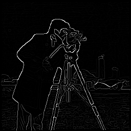

# canny-edge-detector
Canny edge detector with gui written in Matlab

# Algorithm

* Gaussian filtering with kernel size h of scale sigma

* Calculation of magnitude using Sobel operator in 2 directions

* Non-maximal suppression

* Double threshold

* Edge tracking with hysteresis (only edges with at least one strong pixel are recognized as strong edges). This is implemented using recursive grass-fire algorithm for labeling; matrix wrapper is used to avoid passing matrix as a value. Weak edges are then filtered based on labels.

